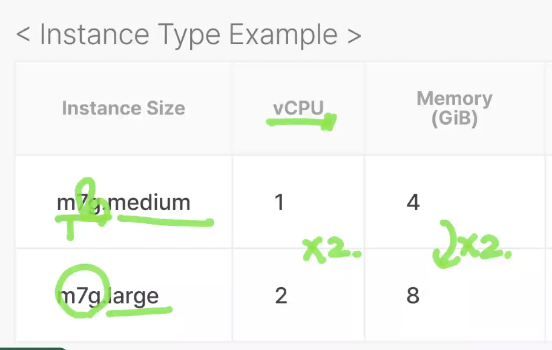
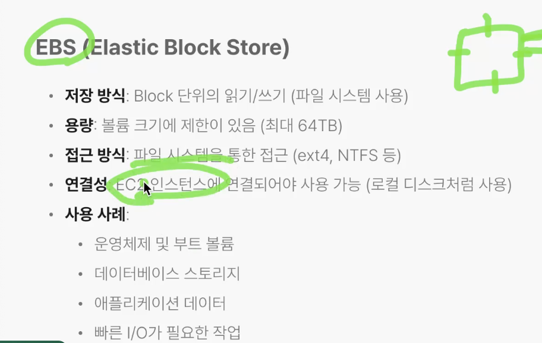

# EC2
- 가상화 서버 : 언제든지 멈추고 시작해서 비용 절감 가능
- TYPE : T4g.micro
    - T : T type (N, P ...)
    - 4 : Generation 4
    - g : Processoer Name
    - micro : Size


```markdown

```
```html

```

## EBS 

```markdown

```
```html
