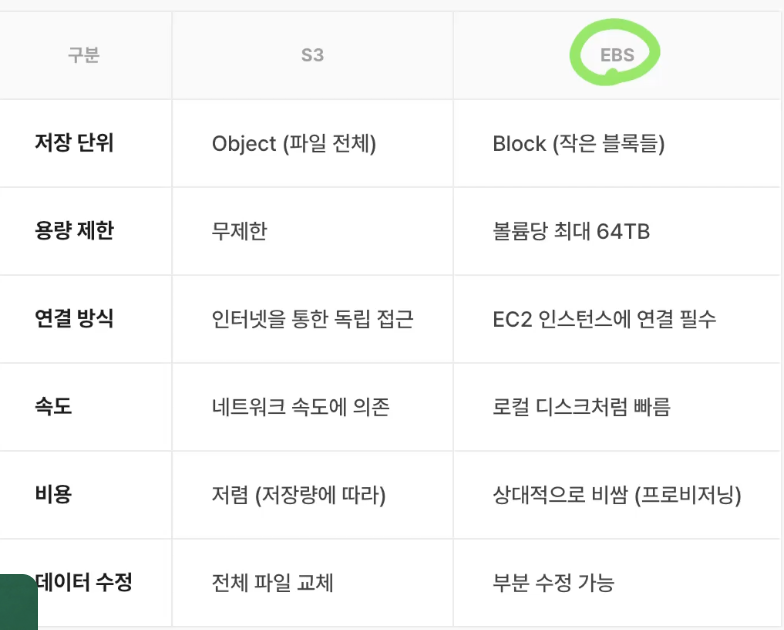
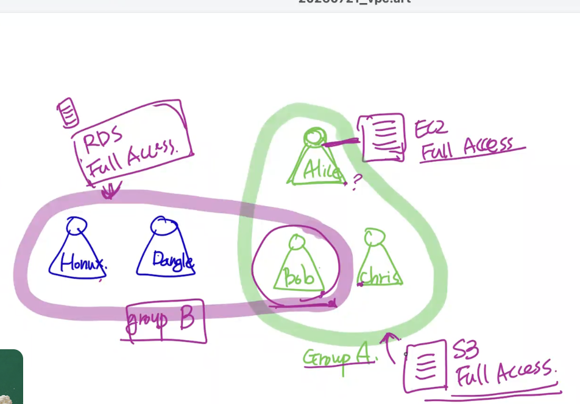
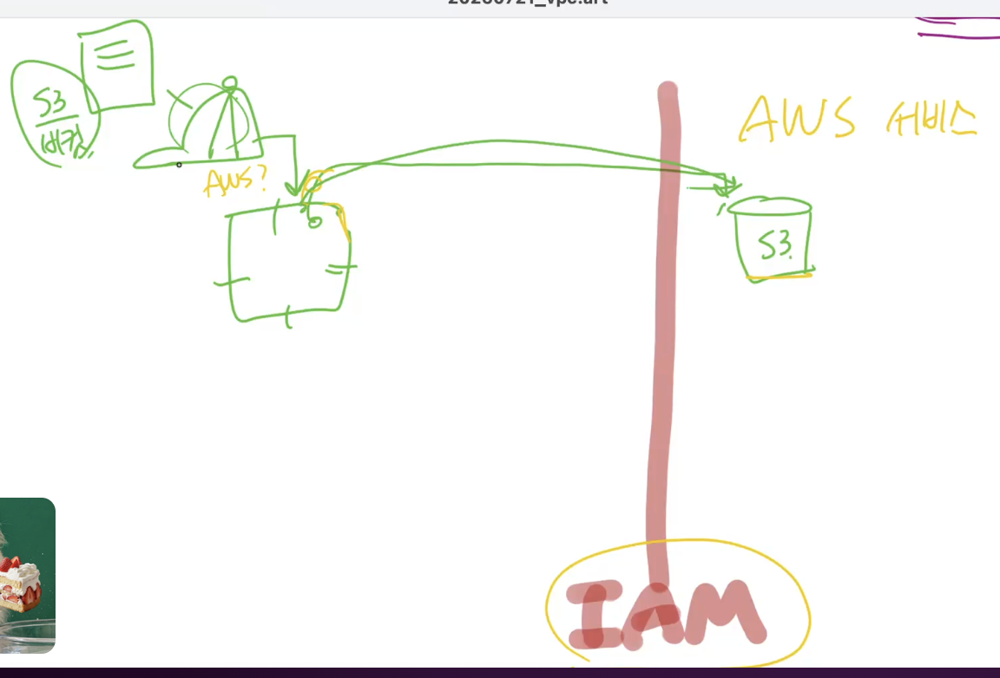

# AWS

## EC2
- 가상화 서버 : 언제든지 멈추고 시작해서 비용 절감 가능
- TYPE : T4g.micro
    - T : T type (N, P ...)
    - 4 : Generation 4
    - g : Processoer Name
    - micro : Size

- 
    

## EBS 

- 
    

## S3
- EBS에 비해서 EC2로부터 독립적이다.

- 
    

## 접근 권한

- user : AWS 사용자
- group : 사용자 모임
- role : 정책 덮어쓰기, AWS 리소스 사용
- policy : 정책(권한) 부여

### Group
- group에게 주어진 정책은 user에게 상속됨
- group간 중첩된 정책도 모두 유효함
- 
    

### Role
- 개인 사용
    - Role을 쓰면 role에 부여된 정책 사용가능 (기존 정책 불가능)
    - Role을 벗으면 다시 개인 정책 사용 가능
- 리소스 사용
    - AWS 서비스에 접근할때 Role을 쓰고 IAM 통과
- 
    

## Serverless
- 서버가 없는 것이 아님
- 사람이 서버 관리를 하지 않는다.

### Serverless Computing : lambda
    - 별도의 EC2서버 사용하지 않음
    - 코드 업로드하고 요청하면 코드 실행
        - 필요할때만 트래픽 생성
        - 호출해주지 않으면 실행 X
    - 제약 조건
        - 성능
            - 메모리 성능에 따라 결정
        - 실행 시간
            - 최대 실행 시간 15분
    - 단점
        - 최초 실행시 runtime 환경 구성에 시간 걸림
    - 구성
        - handler
        - runtime
        - resource setting
        - 실행 역할 : Role 부여 가능

### Serverless DB: DynamoDB
    - NoSQL DB
    - 일관성 2가지 종류
        - default : AP

#### CAP
    - Consistency
    - Availability
    - Partition tolerence
    * 3가지 중 2개만 선택 가능
        - P 반드시 필요
        - 분산 환경에서 필요

        -> CP : 강력한strong - 항상 최신의 값
        -> AP : 최종적eventually - 몇회 후의 최종적으로는 최신의 값
    
#### DynamoDB
    CP 채용