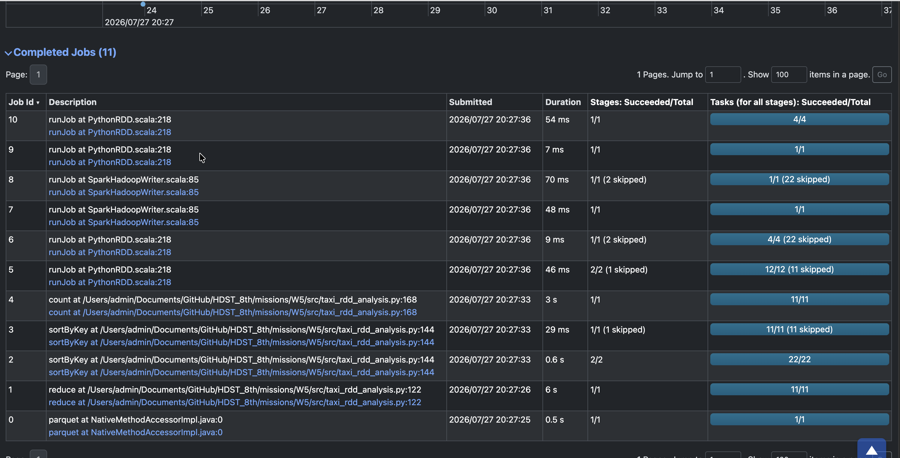
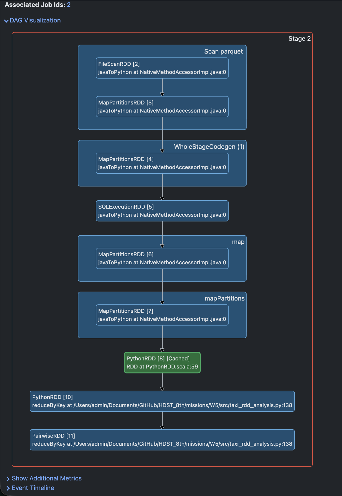

# W5M1 - Spark RDD 기반 NYC Taxi 데이터 분석

## 1. 과제 개요

이번 과제의 목표는 NYC Taxi and Limousine Commission(TLC)의 Trip Record Data를 Apache Spark로 분석하면서 Spark의 내부 동작 원리를 이해하는 것이다.

특히 DataFrame 중심의 분석이 아니라 **RDD API를 사용하여 데이터 로딩, 정제, 변환, 집계, 저장 과정을 직접 구현**한다.

이번 과제를 통해 다음 내용을 확인한다.

- RDD의 생성과 변환 과정
- Transformation과 Action의 차이
- Lazy Evaluation
- DAG와 Stage의 생성 과정
- `map`, `filter`, `reduce`, `reduceByKey` 등의 RDD 연산
- Spark UI를 통한 작업 흐름 확인

---

## 2. 분석 데이터

분석에는 NYC TLC의 Yellow Taxi Trip Record Data를 사용한다.

기존 W4 과제에서 사용한 다음 데이터를 재사용한다.

```text
yellow_tripdata_2026-02.parquet
```

주요 분석 컬럼은 다음과 같다.

| 컬럼 | 설명 |
|---|---|
| `tpep_pickup_datetime` | 승차 시각 |
| `fare_amount` | 기본 운임 |
| `trip_distance` | 이동 거리 |
| `total_amount` | 최종 결제 금액 |

이번 과제의 매출은 요구사항에 따라 `fare_amount`를 기준으로 계산한다.

---

## 3. 프로젝트 구조

Data, Code, Config, Output을 분리하여 다음과 같이 구성한다.

```text
missions/W5/
├── README.md
├── config/
│   └── application.json
├── data/
│   └── raw/
│       └── yellow_tripdata_2026-02.parquet
├── output/
│   ├── summary/
│   └── daily_metrics/
├── screenshots/
│   └── spark_dag.png
└── src/
    └── taxi_rdd_analysis.py
```

각 디렉터리의 역할은 다음과 같다.

| 구분 | 역할 |
|---|---|
| `data/` | 원본 데이터 저장 |
| `src/` | Spark 애플리케이션 코드 |
| `config/` | 입력 경로, 출력 경로, 실행 옵션 관리 |
| `output/` | 최종 분석 결과 저장 |
| `screenshots/` | Spark UI의 DAG 실행 화면 저장 |

원본 데이터와 실행 결과는 용량이 크므로 Git 저장소에는 포함하지 않는다.

```gitignore
missions/W5/data/raw/
missions/W5/output/
```

---

## 4. 전체 처리 흐름

애플리케이션은 다음 순서로 동작한다.

```text
원본 데이터 로딩
        ↓
RDD 생성
        ↓
필요한 컬럼 추출
        ↓
결측값 및 비정상 데이터 제거
        ↓
전체 운행 건수·매출·평균 거리 계산
        ↓
일자별 운행 건수·매출 계산
        ↓
결과 저장
        ↓
Spark UI에서 DAG 확인
```

---

## 5. 데이터 로딩

애플리케이션은 입력 경로와 파일 형식을 설정 파일에서 읽는다.

지원 형식은 다음과 같다.

- CSV
- Parquet

CSV는 `SparkContext.textFile()`로 읽고, Parquet는 Spark의 Parquet Reader로 읽은 뒤 RDD로 변환한다.

```python
if input_format == "csv":
    raw_rdd = spark.sparkContext.textFile(input_path)
elif input_format == "parquet":
    raw_rdd = spark.read.parquet(input_path).rdd
```

Parquet 파일은 구조화된 컬럼 정보를 포함하기 때문에 파일 로딩 단계에서는 DataFrame Reader를 사용하지만, 이후 정제와 집계는 RDD API로 수행한다.

---

## 6. 데이터 정제 기준

다음 조건을 만족하는 데이터만 유효한 운행으로 판단한다.

```text
승차 시각이 존재해야 한다.
fare_amount가 0보다 커야 한다.
trip_distance가 0보다 커야 한다.
필요한 컬럼이 Null이 아니어야 한다.
숫자 컬럼이 정상적으로 변환되어야 한다.
```

핵심 정제 조건은 다음과 같다.

```python
fare_amount > 0
trip_distance > 0
pickup_datetime is not None
```

과제 요구사항에 따라 운임이 0이거나 음수인 운행은 반드시 제외한다.

평균 이동 거리의 왜곡을 막기 위해 이동 거리가 0이거나 음수인 데이터도 제거한다.

---

## 7. RDD 변환 과정

정제된 한 건의 운행 데이터는 다음 구조로 변환한다.

```python
(
    pickup_date,
    fare_amount,
    trip_distance,
)
```

예시는 다음과 같다.

```python
(
    "2026-02-01",
    14.5,
    2.7,
)
```

이번 과제에서는 최소 다섯 개 이상의 RDD Transformation을 사용한다.

| 순서 | RDD 연산 | 역할 |
|---|---|---|
| 1 | `map` | Row 또는 문자열 데이터를 분석 가능한 형태로 변환 |
| 2 | `filter` | 결측값, 음수 운임, 비정상 이동 거리 제거 |
| 3 | `map` | 필요한 컬럼만 추출 |
| 4 | `map` | 일자별 Key-Value RDD 생성 |
| 5 | `reduceByKey` | 일자별 운행 건수와 매출 합계 계산 |
| 6 | `sortByKey` | 날짜 기준 정렬 |
| 7 | `mapValues` | 집계 결과 형식 변환 |

RDD 처리 흐름은 다음과 같다.

```text
raw_rdd
  │
  ├─ map
  │   └─ 컬럼 파싱 및 타입 변환
  │
  ├─ filter
  │   └─ 결측값과 비정상 데이터 제거
  │
  ├─ map
  │   └─ 날짜, 운임, 거리 추출
  │
  ├─ map
  │   └─ 날짜를 Key로 하는 Pair RDD 생성
  │
  ├─ reduceByKey
  │   └─ 일자별 운행 건수와 매출 집계
  │
  └─ sortByKey
      └─ 날짜순 정렬
```

---

## 8. 전체 지표 계산

### 8.1 전체 운행 건수

정제된 RDD에 `count()` Action을 수행한다.

```python
total_trip_count = valid_trip_rdd.count()
```

### 8.2 전체 매출

각 운행을 다음 튜플로 변환한다.

```python
(1, fare_amount, trip_distance)
```

이후 `reduce()`를 사용하여 전체 값을 합산한다.

```python
summary = valid_trip_rdd \
    .map(lambda trip: (1, trip[1], trip[2])) \
    .reduce(
        lambda left, right: (
            left[0] + right[0],
            left[1] + right[1],
            left[2] + right[2],
        )
    )
```

### 8.3 평균 이동 거리

평균 이동 거리는 전체 이동 거리 합계를 전체 운행 건수로 나누어 계산한다.

```python
average_trip_distance = total_distance / total_trip_count
```

---

## 9. 일자별 지표 계산

일자별 분석을 위해 다음 형태의 Pair RDD를 생성한다.

```python
(
    pickup_date,
    (1, fare_amount),
)
```

이후 `reduceByKey()`로 날짜별 운행 건수와 매출을 합산한다.

```python
daily_metrics_rdd = valid_trip_rdd \
    .map(lambda trip: (trip[0], (1, trip[1]))) \
    .reduceByKey(
        lambda left, right: (
            left[0] + right[0],
            left[1] + right[1],
        )
    ) \
    .sortByKey()
```

최종 결과는 다음 형태가 된다.

```text
날짜, 운행 건수, 일자별 매출
```

예시:

```text
2026-02-01, 102345, 2150423.50
2026-02-02, 98421, 2031942.75
```

---

## 10. Lazy Evaluation과 DAG 확인

RDD의 `map`, `filter`, `reduceByKey`와 같은 Transformation은 호출 즉시 실행되지 않는다.

Spark는 Transformation 정보를 Lineage로 기록하고, `count`, `reduce`, `saveAsTextFile`과 같은 Action이 호출될 때 실제 작업을 수행한다.

```text
Transformation 작성
        ↓
실행 계획을 Lineage에 기록
        ↓
Action 호출
        ↓
DAG 생성
        ↓
Stage와 Task로 분리
        ↓
Executor에서 병렬 실행
```

Spark UI에서 다음 항목을 확인한다.

- 전체 Job 수
- Job별 Stage 수
- Stage별 Task 수
- Shuffle 발생 여부
- `reduceByKey` 전후 Stage 분리
- RDD DAG Visualization

`reduceByKey`는 동일한 날짜 Key를 가진 데이터를 Worker 사이에서 재분배해야 하므로 Shuffle이 발생할 수 있다.

이 지점에서 Stage가 분리되는지 Spark UI를 통해 확인한다.

최종적으로 DAG 화면을 캡처하여 다음 경로에 저장한다.

```text
screenshots/spark_dag.png
```

---

## 11. 결과 저장

최종 결과는 두 종류로 나누어 저장한다.

### 11.1 전체 요약 결과

저장 경로:

```text
output/summary/
```

결과 형식:

```csv
total_trip_count,total_revenue,average_trip_distance
3224879,XXXXXXXX.XX,3.45
```

### 11.2 일자별 집계 결과

저장 경로:

```text
output/daily_metrics/
```

결과 형식:

```csv
pickup_date,trip_count,total_revenue
2026-02-01,102345,2150423.50
2026-02-02,98421,2031942.75
```

Spark의 `saveAsTextFile()`은 출력 경로 아래에 여러 개의 `part-*` 파일을 생성할 수 있다.

필요한 경우 결과 RDD의 Partition 수를 줄여 저장 파일 개수를 조정한다.

```python
result_rdd.coalesce(1).saveAsTextFile(output_path)
```

단, 대용량 데이터에서 무조건 `coalesce(1)`을 사용하면 한 Executor에 부하가 집중될 수 있으므로 최종 결과 크기가 작을 때만 사용한다.

---

## 12. 설정 파일

애플리케이션의 경로와 옵션은 `application.json`에서 관리한다.

```json
{
  "app_name": "NYC Taxi RDD Analysis",
  "input_path": "data/raw/yellow_tripdata_2026-02.parquet",
  "input_format": "parquet",
  "summary_output_path": "output/summary",
  "daily_output_path": "output/daily_metrics",
  "output_format": "csv",
  "min_fare_amount": 0,
  "min_trip_distance": 0
}
```

입력 경로와 출력 경로를 코드에서 분리함으로써 다른 월의 TLC 데이터도 설정만 변경하여 분석할 수 있도록 한다.

---

## 13. 실행 방법

프로젝트 루트에서 다음 명령을 실행한다.

```bash
cd missions/W5
```

Spark 애플리케이션 실행:

```bash
spark-submit \
  src/taxi_rdd_analysis.py \
  --config config/application.json
```

Spark Standalone Cluster를 사용하는 경우 Master 주소를 지정한다.

```bash
spark-submit \
  --master spark://spark-master:7077 \
  src/taxi_rdd_analysis.py \
  --config config/application.json
```

---

## 14. 실행 결과

### 14.1 전체 분석 결과

```text
==================================================
NYC Taxi RDD Analysis
==================================================
Input path        : data/raw/yellow_tripdata_2026-02.parquet
Input format      : parquet
Partition count   : 11
Raw row count     : 3,399,866
Valid trip count  : 3,250,043
Invalid trip count: 149,823
Total revenue     : $70,698,931.39
Average distance  : 6.50 miles
==================================================
```

전체 원본 데이터 `3,399,866건` 중 정제 조건을 통과한 데이터는 `3,250,043건`이었다.

제외된 데이터는 `149,823건`이며, 다음 조건에 해당하는 데이터가 제거되었다.

- `pickup_datetime`이 Null인 데이터
- `fare_amount`가 Null이거나 0 이하인 데이터
- `trip_distance`가 Null이거나 0 이하인 데이터
- 데이터 타입 변환에 실패한 데이터

전체 유효 운행의 기본 운임 합계는 `$70,698,931.39`이며, 평균 이동 거리는 `6.50마일`로 계산되었다.

평균 이동 거리가 W4 분석 결과보다 크게 나타난 이유는 이번 과제에서 이동 거리 상한값과 운행 시간 조건을 적용하지 않고, 0 이하의 값만 제거했기 때문이다.

### 14.2 결과 파일

전체 요약 결과는 다음 경로에 저장했다.

```text
output/summary/
```

일자별 운행 건수와 매출 결과는 다음 경로에 저장했다.

```text
output/daily_metrics/
```

Spark의 `saveAsTextFile()`을 사용했기 때문에 각 출력 디렉터리에는 `_SUCCESS` 파일과 `part-*` 결과 파일이 생성된다.

---

## 15. Spark UI 및 DAG 분석



Spark UI에서 전체 작업 결과를 확인한 결과 총 `11개`의 Job이 실행되었다.

주요 Action은 다음과 같다.

- `count()`
- `reduce()`
- `take()`
- `saveAsTextFile()`

RDD의 Transformation은 즉시 실행되지 않고, 위 Action이 호출될 때 실제 Job이 생성되었다.

### 15.1 Stage 및 Shuffle

`reduceByKey()`가 수행된 Stage에서는 다음 결과가 확인되었다.

```text
Tasks         : 11/11
Input         : 27.2 MiB
Shuffle Write : 3.6 KiB
```

이는 11개 파티션에 분산된 데이터를 날짜 Key를 기준으로 다시 모으는 과정에서 Shuffle이 발생했다는 의미이다.

`sortByKey()` Job은 총 2개의 Stage와 22개의 Task로 구성되었다.

```text
Stage 1
각 파티션에서 날짜별 데이터 처리
        ↓ Shuffle
Stage 2
날짜 기준으로 정렬
```

### 15.2 Skipped Stage

Spark UI에는 `6개`의 Skipped Stage가 표시되었다.

이는 오류가 아니라, 앞서 계산된 캐시 또는 Shuffle 결과를 재사용하여 동일한 Stage를 다시 계산하지 않았다는 의미이다.

### 15.3 DAG 이미지


---

## 16. 과제 진행 순서

```text
1. 프로젝트 디렉터리 생성
2. 원본 Parquet 데이터 배치
3. application.json 작성
4. RDD 기반 데이터 로딩 구현
5. 데이터 파싱 및 정제 구현
6. 전체 운행 건수·매출·평균 거리 계산
7. 일자별 운행 건수·매출 계산
8. 결과 파일 저장
9. 로컬 모드 실행 및 결과 검증
10. Spark Cluster에서 spark-submit 실행
11. Spark UI에서 Job, Stage, DAG 확인
12. DAG 화면 캡처
13. 최종 결과와 분석 내용을 README에 추가
```

---

## 17. 결론

이번 과제를 통해 단순한 통계 계산을 넘어 Spark RDD의 실행 구조를 직접 확인했다.

RDD의 Transformation은 즉시 실행되지 않고 Lineage로 누적되며, `count`, `reduce`, `take`, `saveAsTextFile`과 같은 Action이 호출될 때 Spark가 DAG를 생성한다. 이후 Shuffle 경계를 기준으로 Stage가 분리되고 각 Stage의 Task가 파티션 단위로 병렬 실행되는 과정을 Spark UI에서 확인했다.

특히 `reduceByKey`와 `sortByKey` 과정에서 Shuffle이 발생했고, 캐시 및 기존 Shuffle 결과가 재사용되면서 일부 Stage가 Skipped 되는 것도 확인했다.