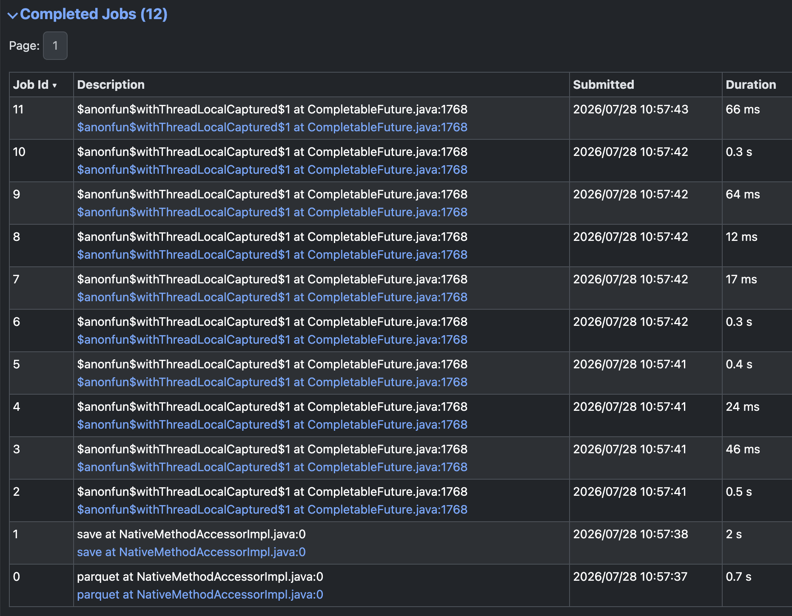
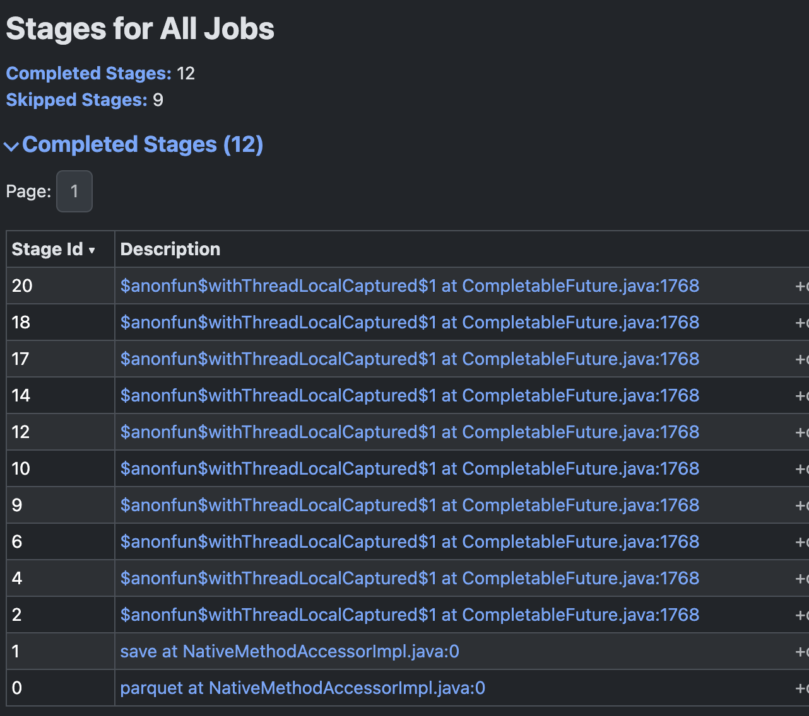
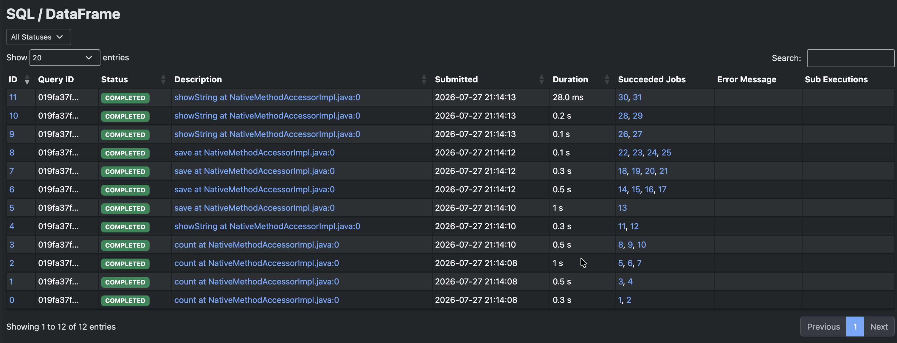
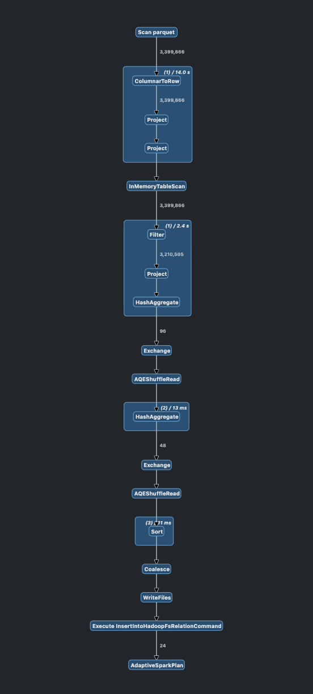

# W5M2 — NYC Taxi DataFrame 및 DAG 분석

## 1. 과제 목표

NYC Taxi and Limousine Commission(TLC) 운행 데이터를 Apache Spark DataFrame으로 처리하고, 변환 과정에서 생성되는 실행 계획과 DAG를 분석한다.

이번 과제에서는 다음 내용을 확인했다.

- Spark DataFrame을 이용한 Parquet 데이터 로딩과 정제
- `select`, `filter`, `withColumn`, `groupBy`, `agg` Transformation 적용
- `count`, `show`, `write` Action 실행
- Lazy Evaluation과 Action 실행 시점의 관계
- Shuffle을 기준으로 나뉘는 Stage와 DAG 구조
- `persist()`를 통한 반복 연산 최적화
- Spark UI를 이용한 Job, Stage, Task 및 DAG 확인

### 1.1 W5M1과의 차이

| 구분 | W5M1 | W5M2 |
|---|---|---|
| 핵심 기술 | RDD | DataFrame |
| 데이터 표현 | Python 튜플·객체 중심 | 컬럼과 스키마 중심 |
| 주요 목적 | RDD 변환과 복구 원리 이해 | DataFrame 실행 계획과 DAG 최적화 이해 |
| 대표 연산 | `map`, `filter`, `reduce`, `reduceByKey` | `select`, `filter`, `withColumn`, `groupBy`, `agg` |
| 최적화 주체 | 개발자가 연산 구조를 직접 설계 | Catalyst Optimizer와 Spark SQL 엔진이 실행 계획 최적화 |
| 스키마 | 기본적으로 없음 | 컬럼명과 데이터 타입이 존재 |
| 분석 관점 | 데이터를 한 행씩 어떻게 변환하는가 | 컬럼 단위 연산이 어떤 실행 계획으로 바뀌는가 |
| 결과 확인 | RDD 결과, 파티션, Lineage | 논리·물리 계획, DAG, Stage, Shuffle |
| 실무 활용 | 저수준 제어, 비정형 처리 | 정형 데이터 ETL, 집계, 분석 |

W5M1이 RDD의 Immutable 특성, Lineage, 장애 복구 원리를 확인하는 과제였다면, W5M2는 DataFrame 연산이 Spark 내부에서 최적화된 실행 계획으로 변환되는 과정을 확인하는 과제다.

## 2. 분석 데이터

- 데이터 출처: NYC TLC Trip Record Data
- 대상 데이터: Yellow Taxi Trip Records
- 분석 파일: `yellow_tripdata_2026-02.parquet`
- 분석 기간: 2026-02-01 이상, 2026-03-01 미만
- 입력 형식: Parquet
- 파일 크기: 약 56MB
- 입력 파티션 수: 11개

원본 파일에는 2026년 1월 31일 데이터 12건과 2026년 3월 1일 데이터 3건이 포함되어 있었다. 데이터 품질 오류와 분석 범위 제외를 구분하기 위해 해당 15건은 무효 데이터로 분류하지 않고 분석 기간 밖의 데이터로 별도 제외했다.

원본 데이터는 Git 저장소에 포함하지 않고 `data/raw/` 아래에서 관리한다.

## 3. 프로젝트 구조

```text
w5m2/
├── README.md
├── .gitignore
├── config/
│   └── analysis_config.py
├── data/
│   └── raw/
│       └── yellow_tripdata_2026-02.parquet
├── output/
│   ├── cleaned_trips/
│   ├── hourly_summary/
│   ├── daily_summary/
│   └── quality_summary/
├── screenshots/
│   └── spark_ui/
└── src/
    ├── main.py
    ├── extract.py
    ├── transform.py
    └── load.py
```

- `data/`: 원본 입력 데이터
- `src/`: 데이터 로딩, 정제, 집계, 저장 코드
- `config/`: 입력·출력 경로와 정제 기준
- `output/`: 정제 데이터와 집계 결과
- `screenshots/`: Spark UI 실행 화면

## 4. Data / Code / Config 분리

### Data

- 원본 Parquet 데이터
- 정제된 운행 데이터
- 시간대별·일자별 집계 결과
- 데이터 품질 요약

### Code

- `extract.py`: SparkSession 생성 및 Parquet 로딩
- `transform.py`: 컬럼 선택, 기간 필터, 파생 컬럼 생성, 데이터 검증, 집계
- `load.py`: 결과 저장
- `main.py`: 전체 파이프라인 실행

### Config

`analysis_config.py`에서 다음 값을 관리한다.

- 입력 및 출력 경로
- Spark 애플리케이션 이름
- 실행 Master URL
- 분석 시작일과 종료일
- 최대 이동 거리
- 최대 운행 시간
- 출력 형식과 저장 모드

경로와 정제 기준을 코드에 직접 하드코딩하지 않아 동일한 파이프라인을 다른 월 데이터에도 적용할 수 있도록 구성했다.

## 5. 분석 흐름

```text
Parquet 입력
    ↓
필수 컬럼 선택
    ↓
분석 기간 필터
    ↓
운행 시간·일자·시간대 파생 컬럼 생성
    ↓
검증 사유 컬럼 생성
    ↓
유효 데이터와 무효 데이터 분리
    ↓
persist 적용
    ↓
시간대별·일자별 집계
    ↓
품질 요약 및 결과 저장
```

### 5.1 Extract

Spark의 Parquet Reader를 이용해 TLC 데이터를 DataFrame으로 읽었다.

```python
trip_df = spark.read.parquet(str(input_path))
```

로딩 후 다음 항목을 확인했다.

- 입력 경로
- DataFrame 스키마
- 파티션 수
- 샘플 데이터

주요 컬럼 타입은 다음과 같다.

```text
tpep_pickup_datetime  : timestamp_ntz
tpep_dropoff_datetime : timestamp_ntz
passenger_count       : long
trip_distance         : double
fare_amount           : double
total_amount          : double
```

### 5.2 Transform

분석에 필요한 컬럼만 초기에 선택하고, 승차 시각을 기준으로 2026년 2월 데이터만 남겼다.

생성한 파생 컬럼은 다음과 같다.

- `trip_duration_minutes`: 승차 시각과 하차 시각의 차이
- `pickup_date`: 승차 일자
- `pickup_hour`: 승차 시간대

#### 데이터 정제 기준

- 필수 컬럼이 Null이 아닐 것
- 하차 시각이 승차 시각보다 늦을 것
- 이동 거리가 0보다 클 것
- 이동 거리가 100마일 이하일 것
- 운행 시간이 300분 이하일 것
- 운임이 음수가 아닐 것
- 총 결제 금액이 음수가 아닐 것

무효 데이터를 바로 제거하지 않고 `validation_reason` 컬럼에 첫 번째 무효 사유를 기록한 뒤 유효 데이터와 무효 데이터를 분리했다.

```text
missing_required_value
invalid_datetime_order
non_positive_distance
excessive_distance
excessive_duration
negative_fare
negative_total_amount
```

이를 통해 파이프라인이 정상 종료되더라도 잘못된 데이터가 조용히 제거되는 Silent Failure를 방지했다.

### 5.3 Aggregate

유효 데이터에 대해 다음 집계를 수행했다.

#### 시간대별 집계

- 운행 건수
- 평균 이동 거리
- 평균 운행 시간
- 총수익
- 건당 평균 수익

#### 일자별 집계

- 운행 건수
- 평균 이동 거리
- 평균 운행 시간
- 총수익

### 5.4 Load

결과를 Parquet 형식으로 저장했다.

- `output/cleaned_trips/`: 정제된 유효 운행 데이터
- `output/hourly_summary/`: 시간대별 집계
- `output/daily_summary/`: 일자별 집계
- `output/quality_summary/`: 무효 사유별 건수

정제 데이터는 원본 파티션 구조를 유지하고, 크기가 작은 집계 결과만 `coalesce(1)`을 적용했다.

## 6. 실행 방법

프로젝트 루트에서 다음 명령으로 실행한다.

```bash
python -m src.main
```

사용한 로컬 실행 환경은 다음과 같다.

```text
PySpark : 4.2.0
Master  : local[*]
```

## 7. 실행 결과

```text
Input path            : data/raw/yellow_tripdata_2026-02.parquet
Partition count       : 11
Raw row count         : 3,399,866
Out-of-period count   : 15
Valid trip count      : 3,210,520
Invalid trip count    : 189,331
```

다음 관계가 성립한다.

```text
Raw row count
= Out-of-period count
+ Valid trip count
+ Invalid trip count
```

```text
3,399,866
= 15 + 3,210,520 + 189,331
```

분석 기간 필터를 적용하기 전 실행에서는 무효 데이터가 189,346건이었으며, 이 값에는 분석 기간 밖의 15건이 포함되어 있었다. 기간 필터 적용 후에는 해당 데이터를 별도 제외하므로 분석 기간 내 무효 데이터는 189,331건이다.

### 7.1 무효 사유별 건수

| 무효 사유 | 건수 |
|---|---:|
| 이동 거리 0 이하 | 122,354 |
| 하차 시각이 승차 시각보다 빠르거나 같음 | 40,598 |
| 음수 운임 | 24,641 |
| 운행 시간 300분 초과 | 1,134 |
| 음수 총 결제 금액 | 447 |
| 이동 거리 100마일 초과 | 172 |

가장 큰 품질 문제는 이동 거리 0 이하 데이터였으며 전체 무효 데이터의 대부분을 차지했다. 또한 샘플 데이터에서도 승차 시각과 하차 시각이 동일하지만 이동 거리와 요금이 존재하는 레코드를 확인할 수 있었다.

### 7.2 시간대별 분석 결과

운행 건수가 가장 많은 시간대는 18시였다.

| 시간대 | 운행 건수 | 총수익 | 건당 평균 수익 |
|---:|---:|---:|---:|
| 18시 | 220,353 | 6,608,299.32 | 29.99 |
| 17시 | 205,117 | 6,325,765.77 | 30.84 |
| 21시 | 200,259 | 6,136,951.03 | 30.65 |
| 19시 | 199,741 | 6,083,905.33 | 30.46 |
| 20시 | 196,858 | 5,931,332.61 | 30.13 |

18시는 운행 건수와 총수익이 모두 가장 높았다. 반면 건당 평균 수익은 새벽 4~5시가 높았다.

```text
04시 평균 수익: 36.10
05시 평균 수익: 36.52
```

이는 새벽 시간대의 운행 건수는 적지만 평균 이동 거리가 더 길기 때문으로 해석할 수 있다.

### 7.3 일자별 분석 결과

분석 기간은 2026년 2월 1일부터 2월 28일까지이며, 기간 필터 적용 후 일자별 결과는 총 28행으로 생성됐다.

운행 건수가 가장 많은 날은 2월 7일이었다.

```text
2026-02-07
운행 건수: 149,980
총수익    : 4,292,921.19
```

운행 건수가 가장 적은 날은 2월 23일이었다.

```text
2026-02-23
운행 건수: 22,840
총수익    : 640,390.74
```

2월 23일은 다른 날짜보다 운행 건수와 총수익이 급격히 낮아 외부 요인 또는 데이터 수집 상태를 추가로 확인할 필요가 있다.

## 8. Lazy Evaluation 검증

DataFrame 로딩과 Transformation 정의 직후 다음 메시지를 출력했다.

```text
Transformations have been defined.
No Action has been executed yet.
```

이 시점에는 `select`, `filter`, `withColumn`, `groupBy` 등의 연산이 실행되지 않고 논리 실행 계획에만 기록된다.

이후 다음 Action을 호출하면서 실제 Job이 생성됐다.

```python
raw_df.count()
period_filtered_df.count()
valid_df.count()
invalid_df.count()
invalid_reason_df.show()
hourly_summary_df.show()
daily_summary_df.show()
valid_df.show()
df.write.save()
```

Spark UI의 SQL / DataFrame 화면에서는 `count`, `showString`, `save` 실행을 확인할 수 있었다. 하나의 Action이 내부 처리 과정에 따라 여러 Job으로 나뉠 수도 있으므로 Action과 Job은 항상 일대일 대응하지 않는다.

## 9. DAG 및 Stage 분석

예상한 주요 실행 흐름은 다음과 같다.

```text
Scan Parquet
    ↓
Project
    ↓
Filter
    ↓
WithColumn
    ↓
InMemoryTableScan
    ↓
Exchange
    ↓
HashAggregate
    ↓
Sort / Write
```

### 9.1 Narrow Transformation

다음 연산은 일반적으로 파티션 간 데이터 이동 없이 같은 Stage 안에서 처리될 수 있다.

- `select`
- `filter`
- `withColumn`

Spark SQL은 이 연산들을 `WholeStageCodegen`으로 묶어 하나의 Java 실행 코드로 생성해 함수 호출 오버헤드를 줄였다.

### 9.2 Shuffle과 Stage 경계

시간대별·일자별 `groupBy`에서는 같은 키를 가진 데이터를 하나의 파티션으로 모아야 한다.

```text
groupBy
→ Exchange
→ Shuffle Write
→ 데이터 재분배
→ Shuffle Read
→ HashAggregate
```

Spark UI의 Stage 화면에서 Shuffle Read와 Shuffle Write가 확인되었고, DAG Visualization에서는 `Exchange` 노드가 나타났다. 이 `Exchange`가 Shuffle 경계이며 새로운 Stage가 만들어지는 기준이 된다.

### 9.3 파티션과 Task

원본 DataFrame의 파티션 수는 11개였다. 따라서 원본 또는 캐시된 데이터를 처리하는 주요 Stage에서는 다음과 같이 11개의 Task가 실행됐다.

```text
입력 파티션 11개
→ Task 11개
```

집계 후 결과 크기가 작아지거나 `coalesce(1)`이 적용된 구간에서는 1개의 Task만 실행된 Stage도 확인할 수 있었다.

### 9.4 Completed Job과 Skipped Stage

Spark UI에서 다음 결과를 확인했다.

```text
Completed Jobs   : 32
Completed Stages : 32
Skipped Stages   : 19
```

Job 수가 많은 이유는 결과 확인과 저장 과정에서 `count`, `show`, `write` Action을 여러 번 실행했기 때문이다.

Skipped Stage와 Skipped Task는 실패가 아니라, 이미 계산된 결과를 Spark가 재사용했다는 의미다.

## 10. `persist()` 최적화

유효 데이터와 무효 데이터는 이후 여러 Action과 집계에서 반복 사용되므로 다음과 같이 저장했다.

```python
valid_df = valid_df.persist(StorageLevel.MEMORY_AND_DISK)
invalid_df = invalid_df.persist(StorageLevel.MEMORY_AND_DISK)
```

Spark UI의 DAG에서는 `InMemoryTableScan`이 확인됐다. 이는 후속 연산이 원본 Parquet부터 정제 과정을 반복 실행하지 않고 캐시된 데이터를 읽었다는 의미다.

또한 일부 Stage와 Task가 skipped 상태로 표시되어 이전 계산 결과가 재사용됐음을 확인했다.

모든 연산이 끝난 뒤에는 다음과 같이 캐시를 해제했다.

```python
valid_df.unpersist()
invalid_df.unpersist()
```

## 11. 실행 계획 확인

시간대별·일자별 집계 DataFrame에 대해 다음 명령을 실행했다.

```python
hourly_summary_df.explain(mode="formatted")
daily_summary_df.explain(mode="formatted")
```

실행 계획에서 확인할 주요 연산은 다음과 같다.

- `Scan parquet`: 원본 Parquet 읽기
- `Filter`: 분석 기간과 유효 데이터 조건 적용
- `Project`: 컬럼 선택 및 파생 컬럼 계산
- `InMemoryTableScan`: persist된 DataFrame 재사용
- `HashAggregate`: 시간대별·일자별 집계
- `Exchange`: groupBy 및 정렬 과정의 Shuffle
- `Sort`: 시간대와 일자 순서 정렬

## 12. Spark UI 캡처

### 12.1 Completed Jobs



여러 Action 실행으로 총 32개의 Job이 생성된 것을 확인했다.

### 12.2 Completed Stages



11개의 입력 파티션에 대응하는 Task와 Shuffle Read·Write를 확인했다.

### 12.3 SQL / DataFrame



`count`, `showString`, `save` Action과 각 Action에서 생성된 Job을 확인했다.

### 12.4 DAG Visualization



DAG에서 `Scan parquet`, `WholeStageCodegen`, `InMemoryTableScan`, `Exchange`를 확인했다.

## 13. 최적화 전략

### 13.1 필요한 컬럼만 조기에 선택

원본 20개 컬럼 중 분석과 품질 검증에 필요한 컬럼만 먼저 선택해 이후 처리량을 줄였다.

### 13.2 분석 기간 및 품질 필터를 집계보다 먼저 적용

집계 전에 기간 밖 데이터와 무효 데이터를 제거해 Shuffle 대상 데이터의 양을 줄였다.

### 13.3 반복 사용하는 DataFrame persist

유효·무효 DataFrame을 `MEMORY_AND_DISK`에 저장해 반복 Action에서 원본부터 다시 계산하는 비용을 줄였다.

### 13.4 집계 결과만 `coalesce(1)` 적용

정제 데이터는 병렬성을 유지하고, 24행 또는 28행 수준의 소규모 집계 결과에만 `coalesce(1)`을 적용했다.

### 13.5 불필요한 Action 최소화 필요

이번 과제에서는 Lazy Evaluation과 Spark UI 실행 과정을 확인하기 위해 여러 `count()`와 `show()`를 호출했다. 운영 파이프라인에서는 결과 확인용 Action을 줄여 불필요한 Job 생성을 최소화해야 한다.

## 14. 결론

이번 과제를 통해 DataFrame Transformation은 즉시 실행되지 않고 논리 실행 계획에 기록되며, Action이 호출될 때 실제 Job과 Stage가 생성된다는 점을 확인했다.

`select`, `filter`, `withColumn`은 같은 Stage에서 파이프라인 형태로 실행될 수 있었고, `groupBy`에서는 `Exchange`와 Shuffle이 발생해 Stage가 분리됐다. 원본 11개 파티션은 주요 Stage에서 11개의 Task로 병렬 처리됐다.

정제된 DataFrame에 `persist()`를 적용한 결과 Spark UI에서 `InMemoryTableScan`, Skipped Stage, Skipped Task를 확인할 수 있었다. 이를 통해 반복 연산에서 원본 데이터부터 다시 계산하지 않고 캐시된 결과를 재사용한다는 점을 검증했다.

W5M1에서는 RDD의 Lineage와 복구 원리를 중심으로 Spark의 저수준 동작을 확인했다면, W5M2에서는 DataFrame의 스키마, Catalyst 실행 계획, WholeStageCodegen, Shuffle 및 캐시 재사용을 중심으로 Spark SQL 엔진의 최적화 과정을 확인했다.

